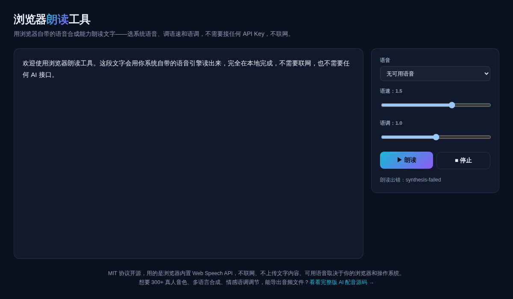

# 浏览器朗读工具 · Text to Speech

**[在线体验 →](https://anna123123123-creator.github.io/text-to-speech/)**

免费开源、纯浏览器运行的文字朗读工具。用的是浏览器/操作系统自带的语音合成能力（Web Speech API），选系统语音、调语速和语调，直接朗读文字——不需要接任何 API Key，不联网，不上传文字内容。



## 试用方法

直接用浏览器打开 `index.html`，或用静态文件服务器跑起来：

```bash
python3 -m http.server 8000
```

可用语音取决于你的浏览器和操作系统——Chrome / Edge / Safari 桌面版通常都自带若干系统语音。移动端浏览器支持情况不一。

## 实现原理

调用浏览器原生的 `SpeechSynthesis` / `SpeechSynthesisUtterance` API，把 `speechSynthesis.getVoices()` 拿到的系统语音列表填进下拉框，选中后设置语速（`rate`）和语调（`pitch`）参数朗读。`script.js` 里大概 60 行原生 JavaScript，没有用任何第三方语音库。

需要说明：这个 API 只能实时播放，浏览器没有提供把朗读结果直接导出成音频文件的标准接口，所以这个工具是"播放"，不是"导出"。

## 协议

MIT。

## 相关项目

这个是做 **AI 配音**产品时顺手做的免费小工具——只能用系统自带的有限语音朗读，不能导出音频文件。完整版是 300+ 真人音色、多语言合成、情感语调调节，支持导出成品音频，源码在这：[AI 配音网站源码](https://inzyxuashop.com/aipeiyin-yuanma.html)。
